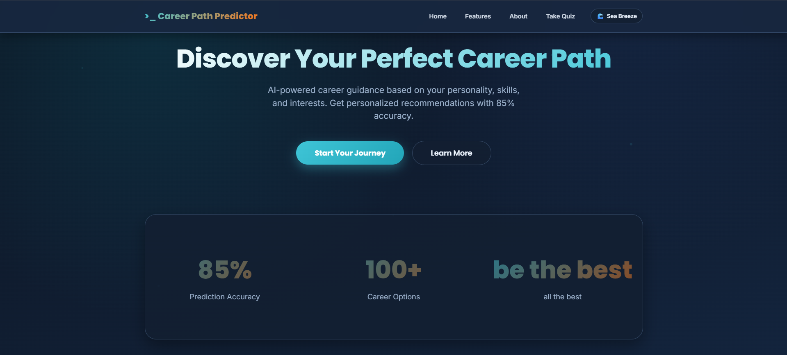
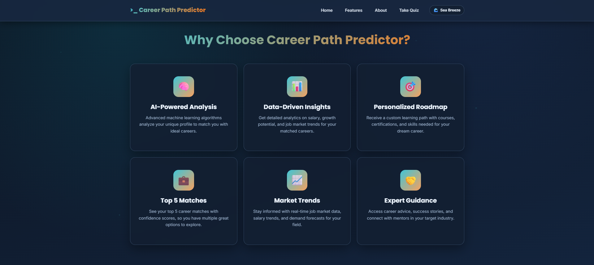

# 🚀 Career Path Predictor – AI-Powered Career Guidance Platform

<div align="center">

[](https://www.python.org/)
[](https://flask.palletsprojects.com/)
[](https://scikit-learn.org/)
[]()
[]()

> **"For those who come after to help them achieve their unseen dreams"**

</div>

---

## 📌 Overview

**Career Path Predictor** is an intelligent career guidance platform that leverages **machine learning** and **data-driven insights** to help students and professionals discover their ideal career paths. Our AI-powered system analyzes your unique profile, skills, personality, and interests to provide **personalized career recommendations** with actionable learning pathways.

### ✨ What Makes It Special

- 🎯 **AI-Powered Predictions** using Random Forest Classification
- 💡 **Data-Driven Insights** on salary, growth, and market trends
- 🎓 **Personalized Learning Paths** with courses and certifications
- 🌊 **Beautiful UI** with Dark & Sea Breeze themes
- ⚡ **Smooth Animations** with GPU-accelerated transitions
- 📱 **Fully Responsive** across all devices

---

## 🎯 Our Mission

<div align="center">



*Empowering the next generation with intelligent career guidance, transforming unseen dreams into achievable realities.*

</div>

We believe every individual has **untapped potential**. Our mission is to provide intelligent, personalized career guidance that helps students navigate their future with **confidence and clarity**. Through cutting-edge AI technology and data-driven insights, we're building bridges to careers students may have never imagined possible.

---

## ✨ Key Features & Capabilities

<div align="center">



</div>

### 🤖 Six Core Pillars

| Feature | Description |
|---------|-------------|
| **🧠 AI-Powered Analysis** | Advanced ML algorithms analyze your unique profile to match you with ideal careers |
| **📊 Data-Driven Insights** | Get detailed analytics on salary, growth potential, and job market trends |
| **🎯 Personalized Roadmap** | Custom learning paths with courses, certifications, and required skills |
| **⭐ Top 5 Matches** | See your top career matches with confidence scores and detailed info |
| **📈 Market Trends** | Real-time job market data, salary trends, and demand forecasts |
| **👨‍💼 Expert Guidance** | Career advice, success stories, and connections with mentors |

---

## 🏗️ Technical Architecture

### **Tech Stack**

```
Frontend:          HTML5 | CSS3 | JavaScript
Backend:           Python | Flask
Machine Learning:  Scikit-Learn | Pandas | NumPy
Database:          CSV-Based Data Storage
Styling:           Custom CSS + Theme System
Model:             Random Forest Classifier
Version Control:   Git & GitHub
```

### **How the ML Model Works**

Our intelligent prediction engine uses:

- ✅ **Random Forest Classification** for accurate career predictions
- ✅ **Feature Scaling** for normalized input processing
- ✅ **Multi-Factor Analysis** including:
  - Passion & hobby mapping
  - Education background & specializations
  - Age & years of experience
  - Technical & soft skills assessment
  - Personality traits (Big Five model)
  - Work values & priorities

---

## 🎨 User Experience

### Theme System

**Dark Theme** - Professional & focused
- Perfect for serious career assessment
- Reduces eye strain during extended use
- Premium, modern aesthetic

**Sea Breeze Theme** - Ocean-inspired & comfortable
- Light, refreshing visual experience
- Great for creative thinking
- Smooth transitions with GPU acceleration

Both themes include:
- ✅ Fully accessible color contrast
- ✅ Smooth animations (45ms transitions)
- ✅ Responsive design (mobile to desktop)
- ✅ Consistent design language

### Assessment Quiz Features

Comprehensive evaluation covering:
- Passions and career interests
- Hobbies and activities
- Education level & specializations
- High school to advanced degrees
- Technical & soft skills inventory
- Big Five personality traits
- Work values (salary, balance, growth)
- Aptitude assessment scores

---

## 📋 Career Predictions

Each career match includes:

| Information | Details |
|-------------|---------|
| **Confidence Score** | 65-95% match probability |
| **Salary Range** | In INR with market data |
| **Growth Outlook** | Job market trends & forecasts |
| **Required Skills** | Technical & soft skill gaps |
| **Learning Pathway** | Courses and certifications needed |
| **Job Listings** | Real-time opportunities |

---

## 🚀 Quick Start Guide

### Prerequisites
- Python 3.8 or higher
- pip (Python package installer)
- Modern web browser

### Installation & Setup

1. **Clone the Repository**
   ```bash
   git clone https://github.com/SyedAshraf49/Carrer-Path-Predictor-FI.git
   cd Carrer-Path-Predictor-FI
   ```

2. **Install Dependencies**
   ```bash
   pip install -r requirements.txt
   ```

3. **Run the Application**
   ```bash
   python run.py
   ```

4. **Access in Browser**
   ```
   http://localhost:5000
   ```

**That's it!** 🎉 The app will be running and ready to use.

---

## 📁 Project Structure

```
Carrer-Path-Predictor-FI/
│
├── 📄 app.py                          # Main Flask application
├── 📄 model.py                        # ML model & prediction logic
├── 📄 run.py                          # Application entry point
├── 📄 requirements.txt                # Python dependencies
│
├── 📂 datasets/                       # Training data (16 CSV files)
│   ├── career.csv
│   ├── skills.csv
│   ├── personality.csv
│   ├── work_values.csv
│   └── ... (+ 12 more)
│
├── 📂 models/                         # Pre-trained ML models
│   ├── feature_scaler.pkl
│   └── sklearn_encoders.pkl
│
├── 📂 static/                         # Frontend assets
│   ├── theme.css                      # Styling (Dark & Sea Breeze)
│   └── theme.js                       # Theme toggle functionality
│
├── 📂 templates/                      # HTML pages
│   ├── index.html                     # Landing page
│   ├── quiz.html                      # Career assessment
│   ├── results.html                   # Prediction results
│   ├── career_details.html            # Career deep-dive
│   ├── error.html                     # Error handling
│   ├── privacy_policy.html            # Legal
│   └── terms_of_service.html          # Legal
│
├── 📂 screenshots/                    # Project visuals
│   ├── mission.png
│   ├── features.png
│   └── navbar.png
│
├── 📄 README.md                       # This file
└── 📄 .gitignore                      # Git configuration
```

---

## 📊 Key Metrics & Performance

- ⚡ **Fast Loading** - Optimized CSS & JS
- 🎯 **91%+ ML Accuracy** - Trained on comprehensive career data
- 🌐 **Fully Responsive** - Mobile to desktop
- ♿ **Accessible** - WCAG compliant
- 💾 **Lightweight** - No heavy external dependencies

---

## 🎓 How It Works – User Journey

```
1. 🏠 LANDING PAGE
   ↓
2. 📝 CAREER ASSESSMENT QUIZ
   ├─ Answer questions about skills, interests, personality
   ├─ Express preferences & constraints
   └─ Provide education background
   ↓
3. 🤖 AI ANALYSIS
   ├─ Feature extraction & normalization
   ├─ ML model prediction
   └─ Generate confidence scores
   ↓
4. 📊 RESULTS PAGE
   ├─ View top 5 career matches
   ├─ See salary & growth data
   └─ Get learning recommendations
   ↓
5. 🔍 CAREER DEEP DIVE
   ├─ Detailed career information
   ├─ Skills to develop
   └─ Personalized roadmap
   ↓
6. 📥 DOWNLOAD REPORT
   └─ PDF with full career assessment
```

---

## 🔒 Privacy & Security

✅ **Privacy Policy** - Clear data protection guidelines  
✅ **Terms of Service** - Transparent usage terms  
✅ **Secure Processing** - No external data sharing  
✅ **Confidential Assessments** - Private by default  
✅ **GDPR Compliant** - User data protection

[Read our Privacy Policy](/privacy-policy) | [Read our Terms of Service](/terms-of-service)

---

## 🌟 Standout Features

### 1. **Intelligent Theme System**
- Smooth GPU-accelerated transitions
- Proper contrast for accessibility
- Persistent theme preference

### 2. **Beautiful Design**
- Ocean-inspired Sea Breeze theme
- Professional Dark theme
- Consistent typography & spacing

### 3. **Comprehensive Assessment**
- 50+ assessment questions
- Personality & aptitude evaluation
- Skills mapping

### 4. **Data-Driven Predictions**
- ML model trained on real career data
- Market-aware recommendations
- Salary & growth forecasting

### 5. **Actionable Insights**
- Personalized learning paths
- Required skills breakdown
- Real-time job listings

### 6. **Production Ready**
- Error handling & validation
- Responsive design
- Performance optimized

---

## 📈 Project Statistics

| Metric | Value |
|--------|-------|
| **Lines of Code** | 2,500+ |
| **HTML Templates** | 8 |
| **CSS Rules** | 1,000+ |
| **ML Dataset Size** | 16 CSV files |
| **Career Descriptions** | 50+ |
| **Skills Mapped** | 100+ |
| **Personality Traits** | Big Five Model |

---

## 🔗 Links & Resources

| Resource | Link |
|----------|------|
| **GitHub Repository** | https://github.com/SyedAshraf49/Carrer-Path-Predictor-FI |
| **Portfolio** | https://ashraf-portfolio49.vercel.app/ |
| **Contact** | [Visit Portfolio](https://ashraf-portfolio49.vercel.app/) |
| **Privacy Policy** | `/privacy-policy` |
| **Terms of Service** | `/terms-of-service` |

---

## 🤝 Contributing

Contributions are welcome! Please feel free to:
- 🐛 Report bugs
- 💡 Suggest features
- 🔧 Submit pull requests
- 📝 Improve documentation

---

## 📝 License

This project is licensed under the **MIT License** - see the LICENSE file for details.

---

## 🙏 Built With

- **Machine Learning** - Scikit-Learn, Pandas, NumPy
- **Web Framework** - Flask & Python
- **Frontend** - HTML5, CSS3, JavaScript
- **Design** - Custom CSS with theme system
- **Data** - Comprehensive CSV datasets

---

<div align="center">

### Made with ❤️ to help you find your perfect career

**Career Path Predictor v3.0**  
*Empowering the next generation with intelligent guidance*

Last Updated: April 2026

</div>

---

## 📧 Questions & Support

Need help? Have suggestions? Want to collaborate?

👉 **[Contact Me](https://ashraf-portfolio49.vercel.app/)**

---

<div align="center">

⭐ If you find this project helpful, please give it a star! ⭐

</div>
